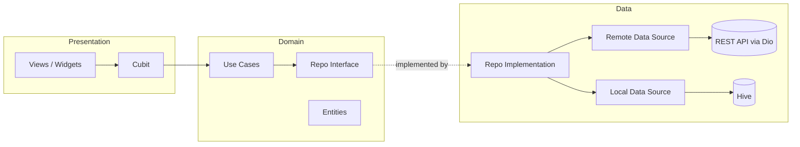

<h1 align="center">📚 Bookly App</h1>

<p align="center">
  A Flutter book-browsing app built with <b>Clean Architecture</b>, <b>Cubit (flutter_bloc)</b>, and a <b>Cache-First</b> data strategy.
</p>

<p align="center">
  
  
  
  
</p>

---

## 🎬 Demo

<p align="center">
  <a href="https://youtu.be/WUHwXAAGYQI">
    
  </a>
</p>

<p align="center">
  <a href="https://youtu.be/WUHwXAAGYQI"><b>▶️ Watch the full demo on YouTube</b></a>
</p>

---


## ✨ Features

- 📖 Browse featured and newest books fetched from a REST API.
- 🔎 View detailed information for each book.
- ♾️ **Pagination** with duplicate-request prevention and graceful failure handling (already-loaded data is never lost if loading more fails).
- ⚡ **Cache-First strategy:** local data is served instantly via Hive, and the network is used when needed.
- 🧯 Centralized, typed error handling for network failures.
- 🎨 Unified design system (colors, text styles, theme) and a responsive layout helper.

---

## 🏗️ Architecture

The project follows **Clean Architecture** with a **Feature-First** folder structure. Each feature is split into three independent layers:



**Dependency rule:** `Presentation → Domain ← Data`. The Domain layer is pure Dart and knows nothing about Flutter, Dio, or Hive.

### Layers

| Layer | Responsibility |
| --- | --- |
| **Presentation** | Views, widgets, and Cubits (states modeled with `sealed class`). |
| **Domain** | Entities, repository contracts, and use cases (business rules). |
| **Data** | Models (JSON), remote/local data sources, and repository implementations. |

### Data Flow (Cache-First)

1. The Cubit calls a **Use Case**.
2. The Use Case calls the **Repository** (interface).
3. The **Repository Implementation** checks the **Local Data Source (Hive)** first.
4. If the cache can't satisfy the request, it fetches from the **Remote Data Source (Dio)** and caches the result.
5. The result returns as `Either<Failure, Data>` (dartz), and the Cubit emits the matching state.

---

## 🧰 Tech Stack & Concepts

| # | Technology / Concept | Purpose |
| :-: | --- | --- |
| 1 | **Flutter & Dart** | Core framework. |
| 2 | **Clean Architecture (Feature-First)** | Data / Domain / Presentation separation per feature. |
| 3 | **flutter_bloc (Cubit)** | State management with `sealed class` states. |
| 4 | **Dio** | REST API communication through `dio_client.dart`. |
| 5 | **dartz (`Either`)** | Functional error handling instead of scattered exceptions. |
| 6 | **Hive** | Local storage and caching for books. |
| 7 | **GetIt** | Dependency Injection (`core/dependency_injection/get_it.dart`). |
| 8 | **Generic `UseCase<T, Params>`** | One unified contract for all use cases. |
| 9 | **Custom Routing System** | `app_router.dart` + `routes.dart` for organized navigation. |
| 10 | **Custom `BlocObserver`** | Tracks state changes across the whole app. |
| 11 | **Responsive Extension** | Size calculation based on screen dimensions. |
| 12 | **Custom Design System** | `app_colors`, `app_text_styles`, `app_theme`. |
| 13 | **Reusable Widgets** | `custom_button`, `custom_text`. |
| 14 | **Custom API Error Handling** | Dio errors classified by status code (`dio_exception`, `api_error`). |
| 15 | **Pagination Logic** | Page tracking, no duplicate calls, safe load-more failures. |
| 16 | **Code Generation** | Hive `TypeAdapter` generated via `hive_generator` / `build_runner`. |
| 17 | **Cache-First Strategy** | Clear rules for when to use cache vs. network. |
| 18 | **Custom Helpers** | Unified `snack_bar` messages. |

---

## 📁 Project Structure

```
lib/
├── core
│   ├── constants
│   │   └── api_endpoints.dart
│   ├── dependency_injection
│   │   └── get_it.dart
│   ├── network
│   │   ├── api_error.dart
│   │   ├── api_services.dart
│   │   ├── dio_client.dart
│   │   └── dio_exception.dart
│   ├── routing
│   │   ├── app_router.dart
│   │   └── routes.dart
│   ├── services
│   │   └── hive
│   │       ├── hive_services.dart
│   │       └── hive_types_ids.dart
│   ├── themes
│   │   ├── app_colors.dart
│   │   ├── app_text_styles.dart
│   │   └── app_theme.dart
│   ├── use_case
│   │   └── use_case.dart
│   ├── utils
│   │   ├── extensions
│   │   │   └── responsive.dart
│   │   └── helpers
│   │       ├── setup_bloc_observer.dart
│   │       └── snack_bar.dart
│   └── widgets
│       ├── custom_button.dart
│       └── custom_text.dart
├── features
│   ├── home
│   │   ├── data
│   │   │   ├── data_source
│   │   │   │   ├── home_local_data_source.dart
│   │   │   │   └── home_remote_data_source.dart
│   │   │   ├── models
│   │   │   │   └── book_model/
│   │   │   └── repos
│   │   │       └── home_repo_impl.dart
│   │   ├── domain
│   │   │   ├── entities
│   │   │   │   ├── book_entity.dart
│   │   │   │   └── book_entity.g.dart
│   │   │   ├── repos
│   │   │   │   └── home_repo.dart
│   │   │   └── use_cases
│   │   │       ├── fetch_home_books_use_case.dart
│   │   │       └── fetch_newest_books_use_case.dart
│   │   └── presentation
│   │       ├── manager/cubit
│   │       │   ├── fetch_home_books_cubit
│   │       │   └── fetch_newest_books_cubit
│   │       └── views
│   │           ├── widgets
│   │           ├── book_details_view.dart
│   │           └── home_view.dart
│   └── splash
│       └── presentation/views
│           ├── widgets
│           └── splash_view.dart
├── bookly_app.dart
└── main.dart
```

---


## 🧠 What I Learned

- Applying Clean Architecture in a real app, and why the dependency rule matters.
- Keeping business logic independent from frameworks through Use Cases and repository contracts.
- Functional error handling with `Either` instead of try/catch scattered across the UI.
- Designing a reliable **cache-first** flow with Hive and a safe **pagination** mechanism.
- Setting up Dependency Injection with GetIt to keep layers loosely coupled.

---


## 👤 Author

**Abdallah Ahmed**

- GitHub: [@your-username](https://github.com/Abdallah-oo/)
- LinkedIn: [your-profile](https://www.linkedin.com/in/abdallah-oo/)
- Portfolio: [your-profile](https://abdallah-ahmed1.vercel.app/)

---

<p align="center">If you found this project useful, consider giving it a ⭐</p>
